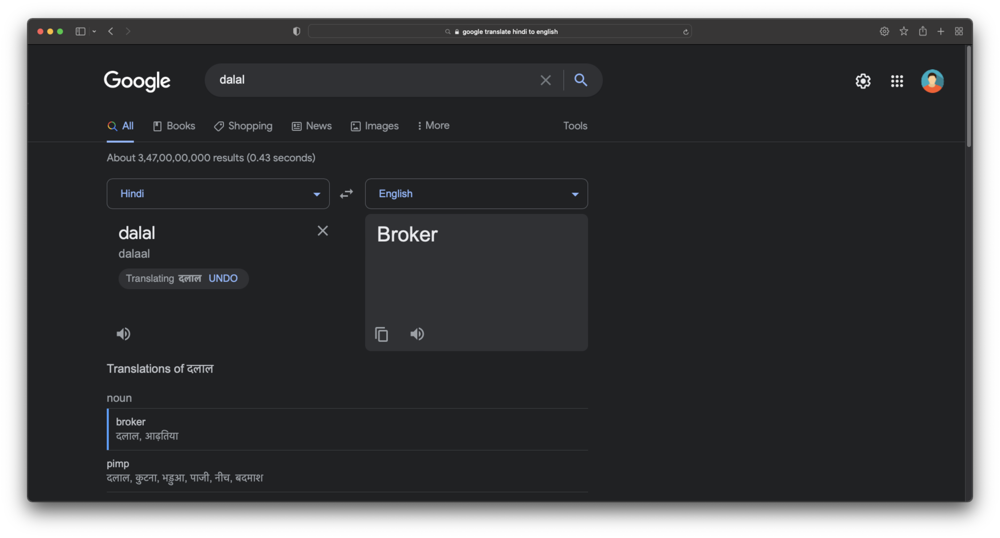
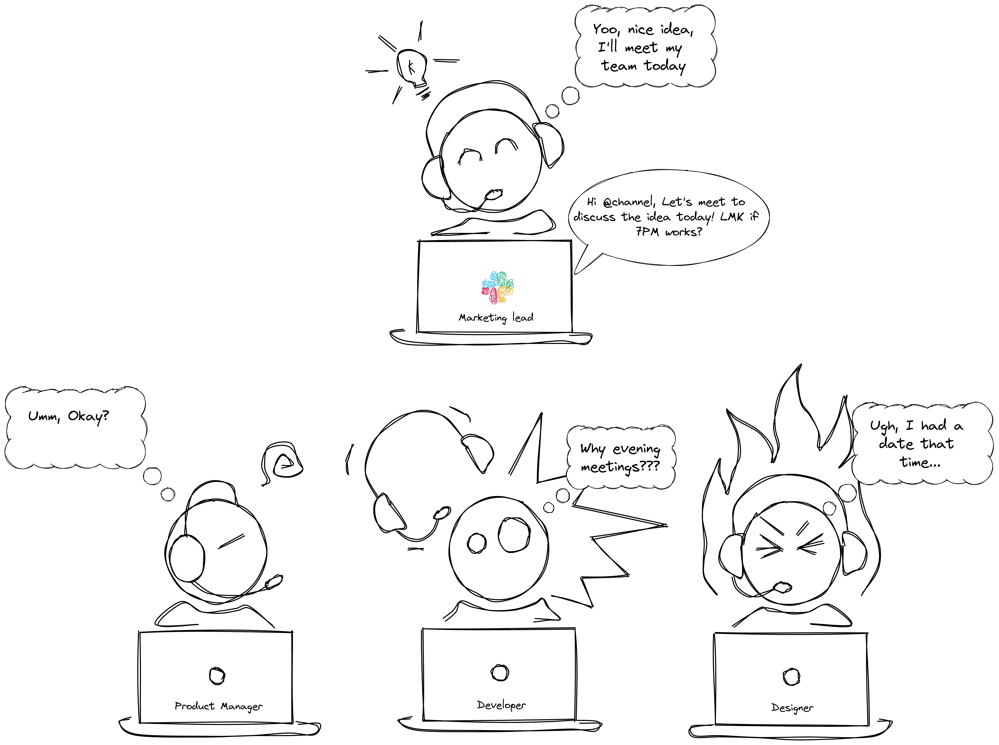
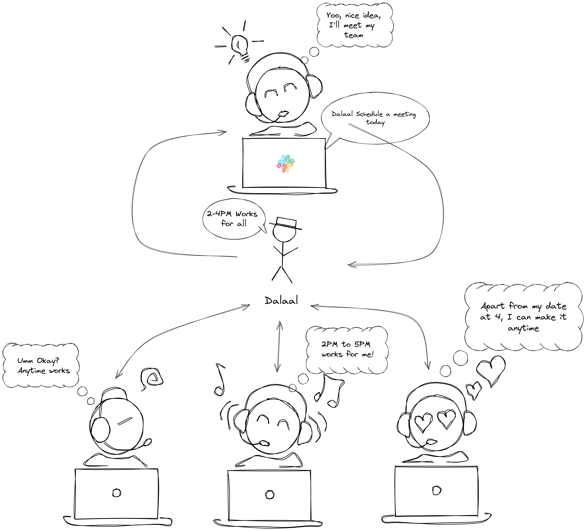

# Dalaal


**Dalaal** is a Slack App that automates meeting scheduling.

Tell Dalaal about

-   the meeting
-   attendees
-   duration
-   host's availability

**That's it.** Next thing you know, Dalaal will do the grunt work of coordinating with everyone and get back to you with a convenient time for your entire team. As simple as that. No hassles, nothing.

## How to Use

-   /authenticate - To get a token for your user with Google OAuth
-   /authenticate `<TOKEN>` - To authenticate the Slack app with your account
-   /meeting - Opens a modal to plan your meeting
-   Once the meeting is planned, Dalaal will DM the invited users to tell Dalaal their preferred slots
-   Dalaal will get back to the admin with the most preferred time slot.
-   Now a Google Calendar Invite will be created and sent to all the members of the meetings via their mails.
-   /show_meetings - Lists all the meetings that are scheduled for you

## Why Dalaal?



Whether you're a small startup or an international organisation, believe it or not, scheduling a meeting has always been a hassle. Finding a convenient time slot has always been challenging for whosoever organises them.

Dalaal automates this process and make it hassle-free for your organisation.

<p align="center">This is how you currently schedule meetings.</p>



### Time for Dalaal to do it's Dalaali

-   Using bolt.js and Block kit, we make an easy to use and fast way that takes in preferable times from the host and asks all the attendees to select the time that suits them.

-   Our algorithm hunts for _that_ perfect time where everyone is available and sets a google meet call by the host's account.

-   Dalaal has a state of the art OAuth mechanism using a slack app and custom scheduling algorithms.

<p align="center">Now, Dalaal does the Dalaali for you.</p>



### Tech Stack

-   Javascript
-   NodeJS
-   MongoDB
-   Bolt.js
-   ExcaliDraw
-   Figma
-   Pitch.com

### Environment Variables

In order to run this project successfully, create a `.env` file filled with keys are shown below. Make sure to fill your credentials and values

```env
SLACK_BOT_TOKEN=<xoxb-token>
SLACK_SIGNING_SECRET=<signing-secret>
SLACK_APP_TOKEN=<xapp-token>
MONGODB_URL=<mongo-url>
GOOGLE_CLIENT_ID=<client-id>
GOOGLE_CLIENT_SECRET=<client-secret>
```

### Development Run

```shell
yarn install
yarn dev
```

### Production Run

```shell
yarn install
yarn start
```

## Show your support

Give a ⭐ if you liked this project!

Spread the word to your fellows to help grow a healthy environment for us!

## License

Licensed under MIT License : https://opensource.org/licenses/MIT

<p align="center">Made with ❤ by Team Alpha</p>
